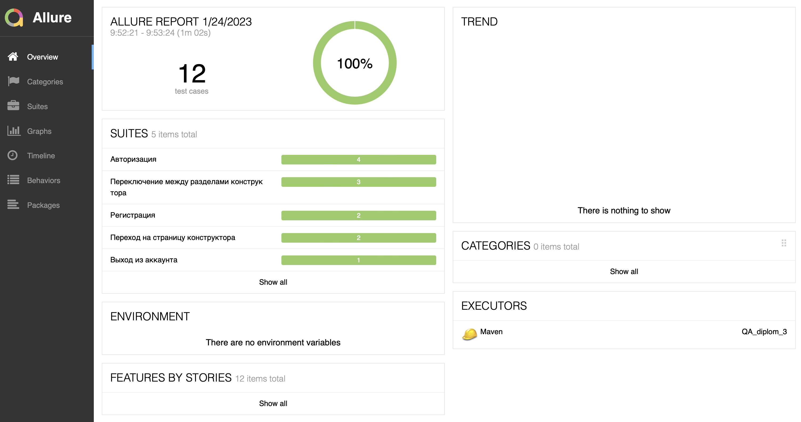

# Проект по автоматизации тестирования веб-приложения [Stellar Burgers](https://stellarburgers.nomoreparties.site)

 
 

 
## Покрытый функционал

 > Разработаны автотесты на <code>UI</code>.

 ### UI

 - [x] Описали веб страницы приложения при помощи паттерна Page Object
     - [x] Протестировали регистрацию нового пользователя:
          - Успешную регистрацию
          - Отображение ошибки для некорректного пароля
     - [x] Вход:
          - Вход по кнопке «Войти в аккаунт» на главной
          - Вход через кнопку «Личный кабинет»
          - Вход через кнопку в форме регистрации
          - Вход через кнопку в форме восстановления пароля
     - [x] Протестировали переход по клику на «Личный кабинет»
     - [x] Переход из личного кабинета в конструктор:
          - Переход по клику на «Конструктор»
          - Переход по клику на логотип Stellar Burgers
     - [x] Проверили выход по кнопке «Выйти» в личном кабинете
     - [x] Раздел «Конструктор». Проверили, что работают переходы к разделам:
          - «Булки»
          - «Соусы»
          - «Начинки»		
 ## Отчет о результатах тестирования в Allure Report
 ### :dart: Главная страница Allure-отчета
 

 
 

 
